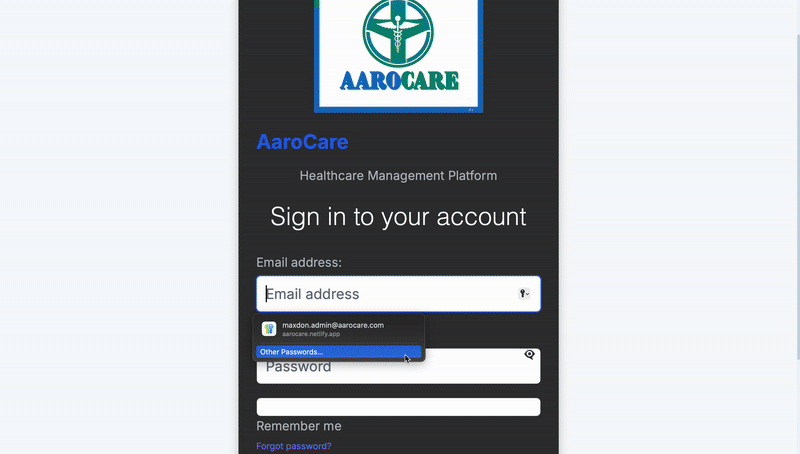

# Aarọ Care

A healthcare management application for streamlined patient care and team coordination.

<div align="center">
  
</div>

Link to the live demo: https://aarocare.netlify.app
**Demo Access**:

A demo account is available for testing. Please contact the project team for credentials.


## 🎬 Demo


## 📖 Table of Contents
- [✨ Features](#features)
- [🎬 Demo](#demo)
- [🏗️ Architecture](#architecture)
- [🚀 Quick Start](#quick-start)
- [📱 Screenshots](#screenshots)
- [🛠️ Tech Stack](#tech-stack)
- [📊 Database Schema](#database-schema)
- [🤝 Contributing](#contributing)
- [📄 License](#license)

## ✨ Features

### 🏥 Core Healthcare Management
- **Patient Registration & Profiles** - Complete patient demographic management
- **Electronic Health Records** - Digital medical records with history tracking
- **Vital Signs Monitoring** - Real-time patient vital signs tracking
- **Treatment Plans** - Comprehensive care planning and tracking

### 👥 Staff & Team Management
- **Care Team Assignment** - Multi-disciplinary team coordination
- **Role-Based Access Control** - Secure access based on staff roles
- **Real-time Collaboration** - Live updates and notifications

### 📊 Advanced Features
- **Real-time Dashboard** - Live patient statistics and alerts
- **Notes & Documentation** - Searchable medical notes system
- **WebSocket Integration** - Real-time updates across the platform
- **Mobile Responsive** - Works seamlessly on all devices

## 🏗️ Architecture

### Frontend
- **React** - Modern web framework
- **Vite** - Fast development environment
- **Tailwind CSS** - Utility-first CSS framework
- **React Router** - Client-side routing
- **Socket.IO** - Real-time communication

### Backend
- **Node.js** - Server-side runtime
- **Express** - Web framework
- **AWS Cognito** - Authentication
- **Supabase** - Database and authentication
- **Socket.IO** - Real-time communication

## 🚀 Quick Start

### Prerequisites

- Node.js
- npm or yarn

### Environment Variables

The application requires several environment variables to be set up. Create a `.env` file in both the root directory and the `backend` directory with the following variables (replace with your actual values):

```
# Frontend (.env in root or aarocare directory)
VITE_AWS_REGION=us-east-1
VITE_COGNITO_USER_POOL_ID=your-user-pool-id
VITE_COGNITO_CLIENT_ID=your-client-id
VITE_COGNITO_DOMAIN=your-cognito-domain
VITE_API_URL=http://localhost:5000
VITE_APP_NAME=Aarọ Care
VITE_SOCKET_URL=http://localhost:3001
VITE_DEBUG=false

# Backend (.env in backend directory)
SUPABASE_URL=your-supabase-url
SUPABASE_SERVICE_KEY=your-supabase-key
```

### Installation

```bash
# Install frontend dependencies
cd aarocare
npm install

# Install backend dependencies
cd ../backend
npm install
```

### Running the Application

```bash
# Start backend
cd backend
npm start

# Start frontend
cd ../aarocare
npm run dev
```

## Security Note

This repository does not contain any sensitive information. All API keys, database credentials, and other secrets should be provided via environment variables and are not committed to version control.
